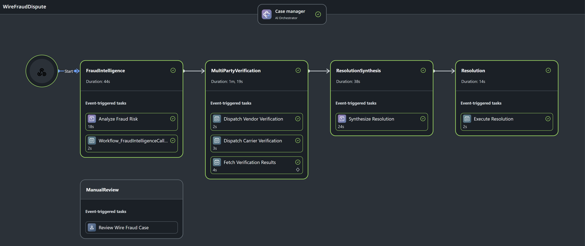
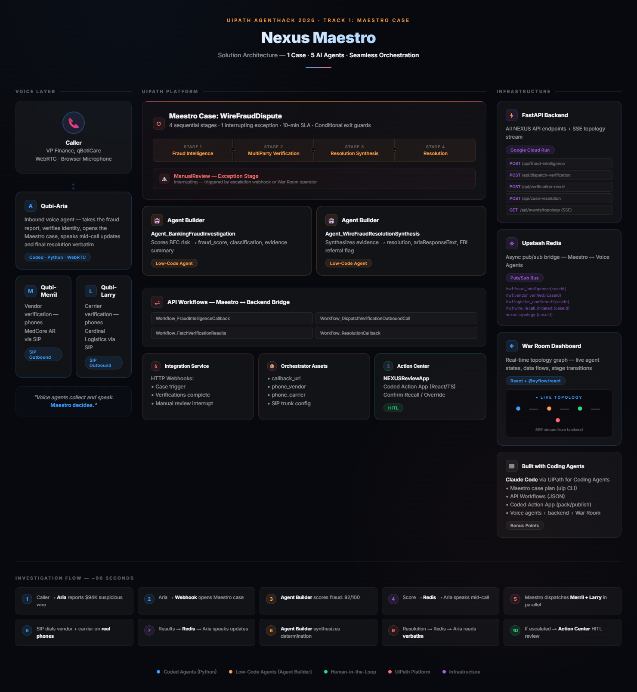

# 🛡️ Nexus Maestro: Real-Time Wire Fraud Investigation via Voice-Orchestrated Multi-Agent Maestro Case

**Nexus Maestro** turns a single phone call into a fully governed, multi-agent wire fraud investigation — five AI agents, one UiPath Maestro case, ~90 seconds from report to resolution.

> **🏅 Hackathon Submission:** [UiPath AgentHack 2025](https://uipath-agenthack.devpost.com/) — **Track 1: UiPath Maestro Case**.
> Nexus Maestro orchestrates a dynamic, exception-heavy BEC wire fraud investigation using UiPath Maestro Case as the central governance brain. Because wire fraud investigations have unpredictable paths and require moving work through distinct stages (FraudIntelligence ➔ MultiPartyVerification ➔ ResolutionSynthesis ➔ Resolution), with an interrupting ManualReview exception stage, a Maestro Case acts as the top-level orchestrator. It seamlessly manages handoffs between two **Agent Builder** decision-making agents, four **API Workflows**, three external **Qubi voice agents**, and human fraud analysts — keeping **the platform in charge at every decision point**.

---

## 1. Project Description (What It Does & The Problem)

**The Problem:** Business Email Compromise (BEC) wire fraud is the #1 B2B payment crime — 76% of AP departments were targeted in 2024, with average losses between $47K–$130K per incident. Investigating a single suspicious wire takes **2–4 days** across multiple teams: fraud analysts, vendor contacts, carrier confirmations, compliance review. The wire recall window? Just **24–48 hours**. Most organizations miss it.

**What It Does:** A treasury officer calls to report a suspicious $94,000 wire. From that single phone call, Nexus Maestro:

1. **Verifies the caller** and pulls wire details from the core banking system, surfacing red flags (beneficiary account only 11 days old, receiving bank doesn't match vendor's bank of record)
2. **Opens a Maestro case** — the investigation brain. An Agent Builder fraud intelligence agent scores the wire at **92/100** (vendor impersonation). The score is spoken to the caller mid-call.
3. **Dispatches parallel outbound SIP calls** — one voice agent phones the vendor, another phones the carrier. Both confirm: no invoice issued, no shipment dispatched. The wire went to a fraudulent account.
4. **A second Agent Builder agent** synthesizes all evidence into a determination and writes the exact words for the voice agent to speak.
5. **The voice agent reads the platform-authored resolution verbatim** to the caller — the voice agents never decided anything.
6. **If inconclusive**, Maestro interrupts into a ManualReview exception stage, opening a task in Action Center rendered by the **NEXUSReviewApp** coded action app.

**Total elapsed time: ~90 seconds.** One phone call, five AI agents, one governed Maestro case.

---

## 2. Agent Type Declaration

**Agent Types Used:**

| Agent Type | Agent Name | Built With | Role |
|---|---|---|---|
| **Low-Code (Agent Builder)** | `Agent_BankingFraudInvestigation` | UiPath Agent Builder (GPT-4o, temp 0) | Fraud scoring & classification — deterministic risk analysis |
| **Low-Code (Agent Builder)** | `Agent_WireFraudResolutionSynthesis` | UiPath Agent Builder (GPT-5.4, temp 0) | Resolution synthesis — writes case narrative & ARIA speech text |
| **External Coded Agent** | `Qubi-Aria` | Python (Deepgram STT + GPT-4o + Cartesia TTS) | Inbound voice agent — caller verification, speaks platform-authored results |
| **External Coded Agent** | `Qubi-Merril` | Python (SIP + WebRTC) | Outbound voice agent — phones vendor for invoice verification |
| **External Coded Agent** | `Qubi-Larry` | Python (SIP + WebRTC) | Outbound voice agent — phones carrier for shipment verification |

> **Architectural principle:** Voice agents **collect information and speak outcomes** — they never make decisions. Every determination is made inside the Maestro case by Agent Builder agents, ensuring full auditability, versioning, and governance.

---

## 3. UiPath Components Used

### 🧠 UiPath Maestro Case (Process Orchestration)

The **backbone of the entire system**. The `WireFraudDispute` case definition governs a 4-stage investigation pipeline with an interrupting exception stage, SLA rules, conditional exit guards, and 20+ case variables tracking the full evidence chain.

**Case Stages:**

**Key Case Features:**
- **SLA Rules:** 60-minute SLA on root case and per-stage, with at-risk (70–75%) and breached escalation thresholds
- **Conditional Exit Guards:** `Exit Rule 1` checks `resolutionAction !== "escalated"` before marking the case complete — this prevents the case from closing before the ManualReview exception stage can fire
- **Interrupting Exception Stage:** ManualReview listens for a `manual-review` HTTP Webhook; when fired, it interrupts the main pipeline and opens a HITL task
- **20+ Case Variables:** `caseId`, `transactionId`, `fraudScore`, `fraudClassification`, `riskFactors`, `evidenceSummary`, `vendorInvoiceVerified`, `vendorBankingChanged`, `shipmentDispatched`, `resolutionAction`, `caseNarrative`, `ariaResponseText`, `fbiReferralRequired`, `wireRecallInitiated`, and more

---

### 🤖 UiPath Agent Builder (Low-Code Agents)

Two deterministic-prompt, temperature-0 agents handle **all decision-making** inside the Maestro case:

#### Agent 1: `Agent_BankingFraudInvestigation`
- **Model:** GPT-4o (`gpt-4o-2024-11-20`), temperature 0, advanced mode
- **Purpose:** Analyze wire transfer data and produce a fraud risk score (0–100) with classification
- **Scoring Guide (from system prompt):**
  - New beneficiary account (< 90 days): **+30 points**
  - Beneficiary bank mismatch with vendor records: **+25 points**
  - Transaction amount above threshold: **+20 points**
  - PO number format anomaly: **+15 points**
  - Multiple risk factors compounding: **+10% bonus**
- **Classification Rules:** `vendor_impersonation` (≥75), `account_takeover` (≥60 + new account), `invoice_fraud` (≥50 + PO anomaly), `low_risk` (<50)
- **Inputs:** `transactionId`, `transactionAmount`, `beneficiaryBank`, `beneficiaryAccountAgeDays`, `vendorId`, `poNumber`
- **Outputs:** `fraudScore`, `fraudClassification`, `riskFactors`, `evidenceSummary`

#### Agent 2: `Agent_WireFraudResolutionSynthesis`
- **Model:** GPT-5.4, temperature 0, standard mode
- **Purpose:** Synthesize all investigation evidence into a final determination, case narrative, and verbatim speech text for the voice agent
- **Resolution Action Rules (from system prompt):**
  - `recall_initiated`: fraudScore ≥ 80 AND (banking changed OR invoice unverified), OR fraudScore ≥ 60 AND no shipment
  - `escalated`: fraudScore ≥ 80 AND shipment dispatched (triggers ManualReview)
  - `declined`: fraudScore < 60 AND invoice verified AND shipment dispatched
  - `monitoring`: all other cases
- **FBI Referral:** Required when `recall_initiated` AND `transactionAmount > $50,000`
- **ARIA Speech Rules:** Under 4 sentences, references amount and action, never says "FBI" directly
- **Inputs:** `caseId`, `transactionAmount`, `fraudScore`, `fraudClassification`, `evidenceSummary`, `vendorInvoiceVerified`, `vendorBankingChanged`, `shipmentDispatched`
- **Outputs:** `resolutionAction`, `caseNarrative`, `ariaResponseText`, `fbiReferralRequired`

---

### ⚡ API Workflows

Four API Workflow projects bridge Maestro case stages to the external voice backend (FastAPI on Google Cloud Run):

| Workflow | Stage | Purpose |
|---|---|---|
| `Workflow_FraudIntelligenceCallback` | FraudIntelligence | Relays the fraud score, classification, and risk factors to the voice backend via `POST /api/fraud-assessment/{caseId}` — ARIA speaks the score to the caller mid-call |
| `Workflow_DispatchVerificationOutboundCall` | MultiPartyVerification | Dispatches outbound SIP calls by hitting `POST /api/dispatch-call` with `contactType` (vendor/carrier), `caseId`, and transaction context — invoked **twice in parallel** (once for vendor, once for carrier) |
| `Workflow_GetVerificationSummaryCallback` | MultiPartyVerification | Triggered by a "results ready" webhook signal; pulls consolidated vendor/carrier verdicts via `GET /api/verification-summary/{caseId}` — a two-step pattern that's more resilient than carrying data in the webhook payload |
| `Workflow_ResolutionCallback` | Resolution | Delivers the AI-generated resolution text to the voice backend via `POST /api/resolution/{caseId}` — ARIA reads it **verbatim** to the caller |

---

### 🔗 Integration Service (HTTP Webhooks)

Three **UiPath HTTP Webhook** connections via Integration Service provide the event triggers that drive the Maestro case lifecycle:

| Webhook | Trigger | Purpose |
|---|---|---|
| **ARIA Wire Fraud Webhook** | Case Creation | Fires when the ARIA voice agent backend detects a wire fraud dispute call — creates the Maestro case with initial transaction data |
| **Verifications Complete Webhook** | Multi-Party Verification Signal | Fires as a "results ready" signal when both vendor and carrier voice agents have completed their outbound calls — triggers `Workflow_GetVerificationSummaryCallback` |
| **Manual Review Webhook** | Exception Stage Interrupt | Fires when the resolution synthesis agent returns `resolutionAction = "escalated"` — interrupts the main pipeline and enters the ManualReview exception stage |

---

### 📋 Action Center (Human-in-the-Loop)

When the AI determines a case is inconclusive (`resolutionAction = "escalated"`), Maestro creates a **task in Action Center** assigned to a fraud analyst. The task is rendered by the **NEXUSReviewApp** coded action app.

**Task Configuration:**
- **Title:** Dynamic — `"Case: {caseId} Wire Fraud Dispute for Manual Review"`
- **Assignment:** User-based (`russ.alfeche@qbotica.com`)
- **Priority:** Medium
- **Outcomes:** `ConfirmRecall` | `OverrideNoAction`
- **Inputs from case:** `caseId`, `transactionAmount`, `fraudScore`, `evidenceSummary`, `resolutionAction`, `caseNarrative`
- **Outputs to case:** `analystDecision`, `analystNotes`, `Action` (outcome)

---

### 🖥️ Coded Action App: NEXUSReviewApp

A **UiPath Coded Action App** (React + TypeScript + Vite) that renders the fraud analyst's HITL review interface inside Action Center. Built entirely by a coding agent (Claude Code) using the `uip codedapp` CLI.

**Action Schema ([`action-schema.json`](NEXUSReviewApp/action-schema.json)):**
- **Inputs:** `caseId` (required), `transactionAmount`, `fraudScore`, `evidenceSummary`, `resolutionAction`, `caseNarrative`
- **Outputs:** `analystDecision` (recall_initiated / no_action), `analystNotes`
- **Outcomes:** `ConfirmRecall`, `OverrideNoAction`

**UI Features ([`Form.tsx`](NEXUSReviewApp/src/components/Form.tsx)):**
- Case header with dynamic case ID chip
- Key figures: disputed amount (USD formatted), fraud risk score with severity-colored progress bar (high ≥75, medium ≥50, low)
- AI recommendation display with severity-aware styling
- Evidence summary and case narrative blocks (read-only, populated from Maestro case)
- Analyst notes textarea (editable)
- Two action buttons: "Confirm Recall" (danger) / "Override — No Action" (secondary)
- Dark/light theme support via UiPath `Theme` API
- Read-only mode detection for already-completed tasks

---

### 🗄️ Orchestrator Assets

Runtime configuration stored as Orchestrator assets:
- Callback URLs for the FastAPI backend endpoints

---

## 4. Supplementary Technologies

While the UiPath Agentic Platform is the governance backbone, these supplementary technologies power the voice and visualization layers:

| Technology | Purpose |
|---|---|
| **Qubi Voice Agents** | Three AI voice agents — Aria (inbound WebRTC), Merril (outbound SIP to vendor), Larry (outbound SIP to carrier) — using Deepgram STT, OpenAI GPT-4o, and Cartesia TTS |
| **Upstash Redis** (Pub/Sub) | Async bridge between Maestro and voice agents — publishes fraud scores, verification results, and resolution text to Redis channels; voice agents subscribe and speak updates mid-call with zero dead air |
| **FastAPI Backend** (Google Cloud Run) | Serves all NEXUS API endpoints consumed by Maestro API Workflows and an SSE topology stream consumed by the War Room dashboard |
| **War Room Dashboard** (React + @xyflow/react) | Real-time 3D knowledge graph / topology dashboard — renders every agent activation, Redis pub/sub message, and Maestro stage transition live with animated edges, payload chips, and agent waveforms |
| **WebRTC infra + SIP** | Real-time voice communication — WebRTC for browser-based inbound calls, SIP trunking for outbound calls to real mobile phones |

---

## 5. Coding Agents: Claude Code + UiPath CLI

This project is a direct example of **combining coding agents with low-code components**: Claude Code built the coded artifacts while Agent Builder provided the low-code decision-making agents inside the Maestro case.

### What the Coding Agent Built

| Component | What Claude Code Did | UiPath CLI Commands Used |
|---|---|---|
| **Maestro Case Plan** | Scaffolded and iterated the `caseplan.json` — stage definitions, entry/exit conditions, SLA rules, conditional exit guards, interrupting exception stage, variable bindings, webhook configurations | `uip solution pack`, `uip solution publish`, `uip solution deploy` |
| **Coded Action App** | Built `NEXUSReviewApp` from action schema through to production — React/TypeScript form component, dark/light theme support, UiPath `codedActionAppService` integration | `uip codedapp init`, `uip codedapp pack`, `uip codedapp publish` |
| **UiPath Solution Management** | Managed the solution lifecycle — project registration, resource binding, deployment configuration, version management | `uip solution project add`, `uip solution resource refresh`, `uip solution deploy config get/set` |

### Coding Agent Context Files

The `CLAUDE.md` and `AGENTS.md` files in [`NEXUSCase/`](NEXUSCase/) serve as the coding agent's context files — they document the UiPath CLI commands, solution structure conventions, project types, deployment lifecycle, and troubleshooting patterns that the coding agent uses to understand and modify the UiPath solution.

---

## 🏗️ Architecture Diagram

---

## 🏗️ Challenges We Ran Into

- **Race condition on case exit:** When the resolution synthesis agent returns `escalated`, the manual-review webhook must fire *before* the Resolution stage completes — otherwise the case closes and ManualReview never enters. Solved with a **conditional exit guard**: Exit Rule 1 checks `resolutionAction !== "escalated"` before marking the case complete.

- **Verification results delivery:** The original design had the verifications-complete webhook carry the actual vendor/carrier data. But webhook payloads are fire-and-forget — if the data was malformed, the case stalled. Redesigned as a **two-step pattern**: webhook is a "results ready" signal that triggers `Workflow_GetVerificationSummaryCallback`, which pulls consolidated verdicts via `GET /api/verification-summary/{caseId}`.

- **Voice agents speaking platform-authored text verbatim:** The resolution text comes from Maestro's synthesis agent — it's not generated by the voice agent's own LLM. Injecting externally-authored speech into an LLM-driven conversation agent without it "improving" or paraphrasing required a dedicated **`speak_verbatim` pattern** that bypasses the conversational pipeline.

- **SIP + WebRTC coexistence:** Running three concurrent Qubi voice sessions (one WebRTC inbound, two SIP outbound) required careful room isolation and participant identity management. Each sub-agent gets its own room keyed by `{contactType}-{caseId}`.

---

## 🏆 Accomplishments

- **Five AI agents orchestrated by one Maestro case** — coded agents (Python/Qubi), low-code agents (Agent Builder), and a human analyst (Action Center) — all governed by a single case definition with SLA rules, exit guards, and an interrupting exception stage.

- **Parallel outbound SIP calls to real mobile phones** — Qubi-Merril and Qubi-Larry dial actual phone numbers during the live investigation. No simulated calls, no mocked responses.

- **Zero dead air** — ARIA speaks fraud scores and verification results the moment they arrive via Redis pub/sub, keeping the caller informed throughout a 90-second investigation.

- **The War Room** — a live 3D topology dashboard rendering every agent activation, data flow, and Maestro stage transition in real time.

- **Voice agents that never decide** — every determination is made inside the Maestro case. Governance by design, not by policy.

---

## 📜 License

This project is licensed under the [MIT License](LICENSE).
